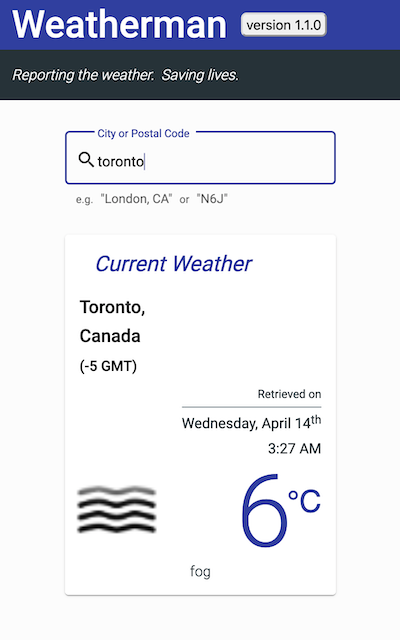
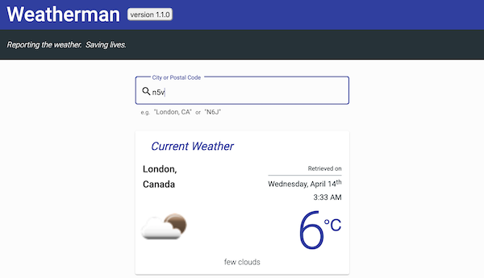
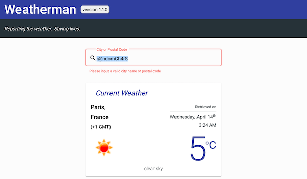

# Weatherman
<i>Reporting the weather. Saving lives.</i> 
Live website available at:&nbsp;&nbsp;&nbsp; [weatherman-mwiraszka.vercel.app/](http://weatherman-mwiraszka.vercel.app/)

 

[Weatherman](https://www.weatherman-mwiraszka.vercel.app) is a single-page web application built using [Angular CLI](https://github.com/angular/angular-cli) (version 11.2.3) and deployed to [Vercel](https://vercel.com/). The app retrieves the current weather for any inputted location –– either by city name or postal code –– through requests to [OpenWeatherMap](https://openweathermap.org/) and [GeoNames](https://www.geonames.org/)' APIs. Weatherman features a modern and intuitive UX through a set of robust form validators, search-as-you-type functionality, as well as Angular Material's many components and style themes.

## Project Contribution

If you wish to contribute to the development of this project, the following commands will get you started:

* Run `ng serve` for a development server. Navigate to `http://localhost:5000/`. The app will automatically reload if you change any of the source files.

* Run `ng generate component <component-name>` to generate a new component. You can also use `ng generate directive|pipe|service|class|guard|interface|enum|module`.

* Run `ng build` to build the project. The build artifacts will be stored in the `dist/` directory. Use the `--prod` flag for a production build.

* Run `ng test` to execute unit tests via [Karma](https://karma-runner.github.io).

* Run `ng e2e` to execute end-to-end tests via [Protractor](http://www.protractortest.org/).
  

## Versioning

This project uses [SemVer](http://semver.org) for versioning.
* <i>13.04.2021</i> - **Version 1.0.0**:
    * Initial release
* <i>14.04.2021</i> - **Version 1.1.0**:
    * Improved design for smaller viewport
    * Version number in header now links to this github repo
    * Hyphen added to list of valid input characters
    * Various miscellaneous styling improvements and bug fixes
  

## Author(s)

* [Michal Wiraszka](https://github.com/mwiraszka)
  

## License

This project is licensed under the MIT License - see the [LICENSE](LICENSE) file for details.
  

## Acknowledgments

* [Doguhan Uluca](https://github.com/duluca "Doguhan's Github page") for sharing his wealth of knowledge on everything Angular
  

## Application Screenshots

[(screenshots of older versions)](https://github.com/mwiraszka/Weatherman/tree/main/screenshots)
